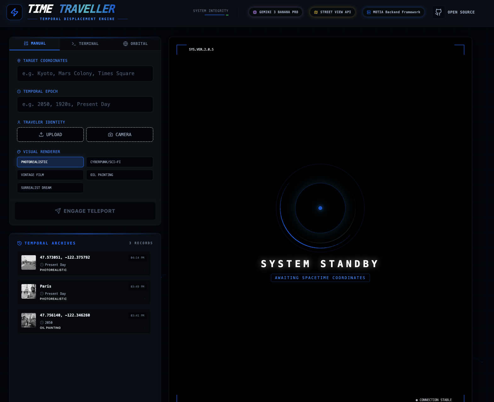
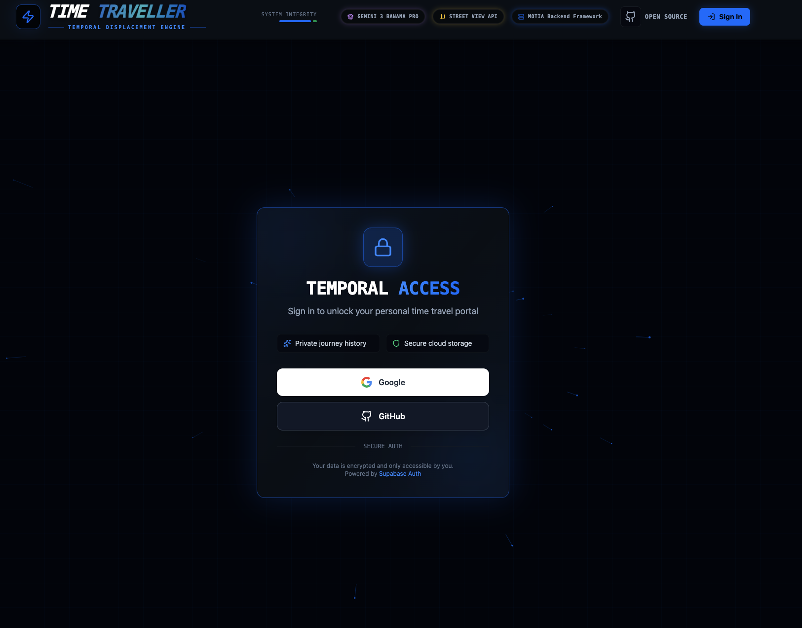
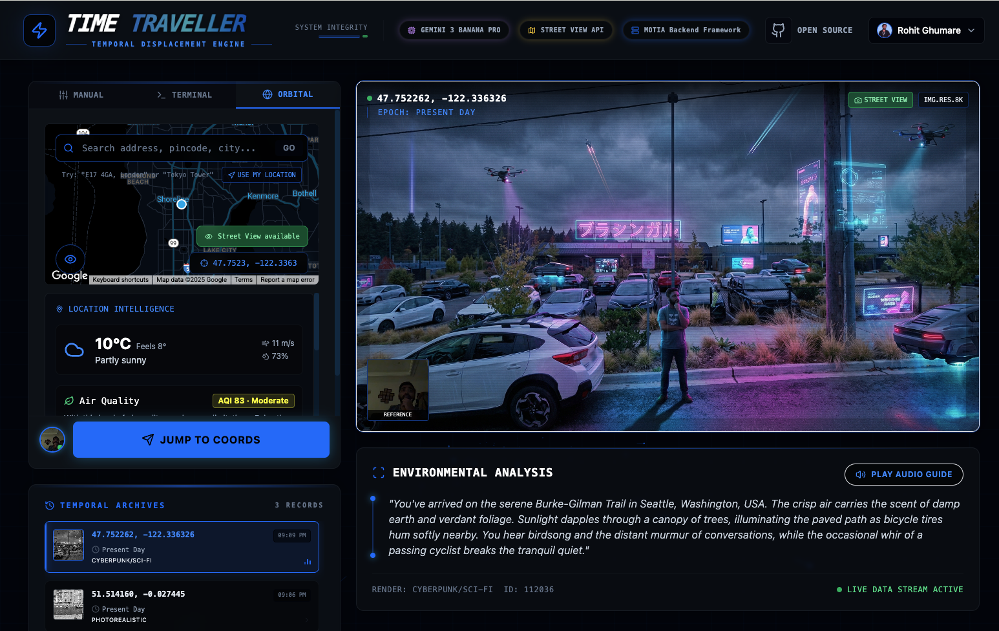
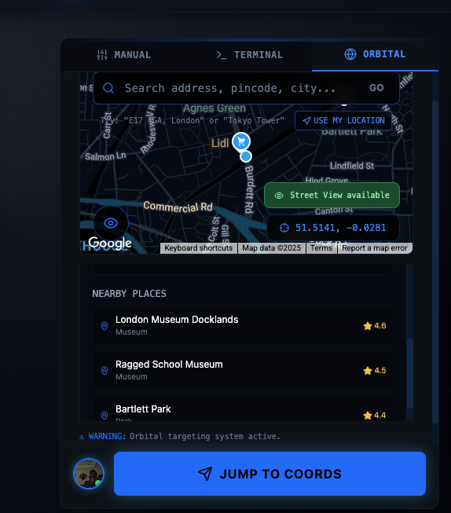
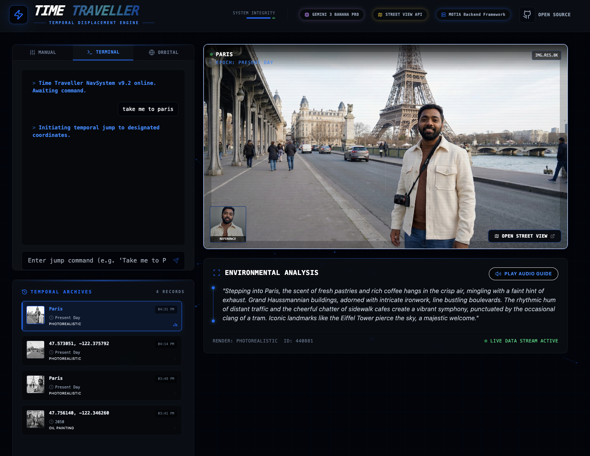
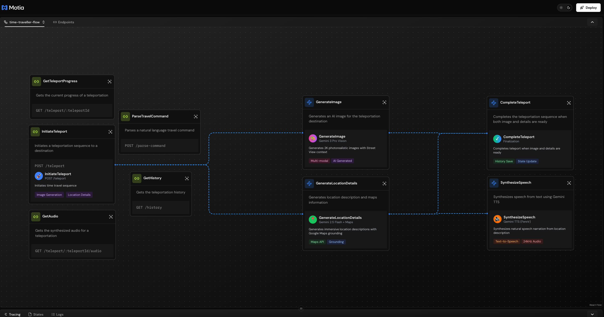
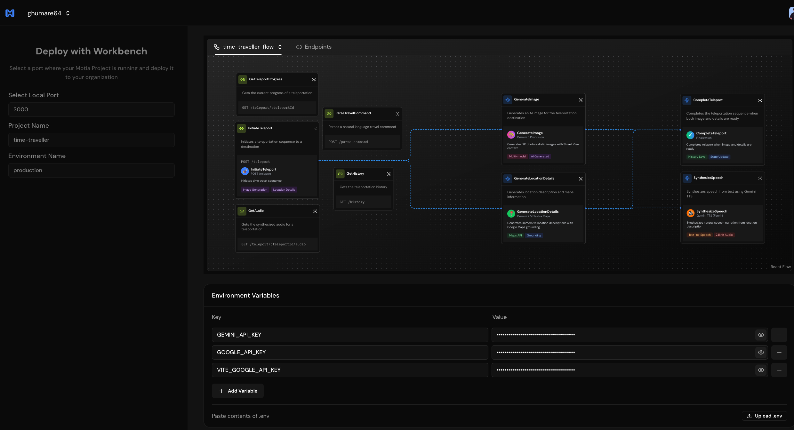
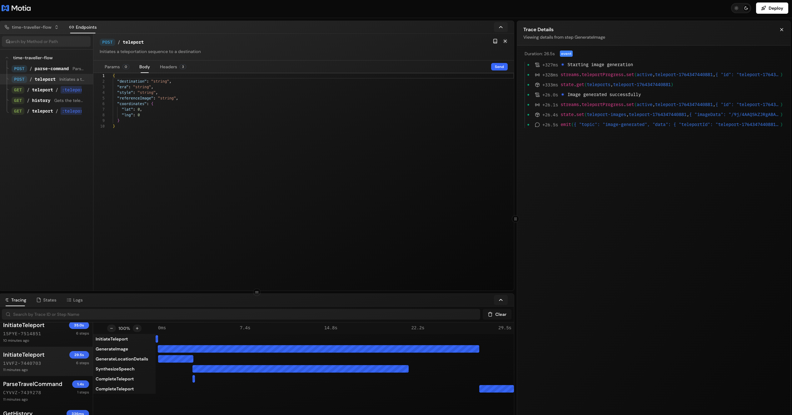

# 🌀 Time Traveller - Virtual Time Machine

<div align="center">


**Step into any moment in history. Witness the past. Visualize the future.**

[🚀 Live Demo](https://time-traveller-motia.vercel.app) • [⭐ GitHub](https://github.com/rohitg00/time-traveller) • [📖 Docs](#-quick-start)

</div>

---

## 🖼️ Screenshots

<div align="center">
<table>
  <tr>
    <td align="center"><br/><sub>Complete UI</sub></td>
    <td align="center"><br/><sub>Authentication</sub></td>
    <td align="center"><br/><sub>AI Generation</sub></td>
  </tr>
  <tr>
    <td align="center"><br/><sub>Location Intelligence</sub></td>
    <td align="center"><br/><sub>Nearby Places</sub></td>
    <td align="center"><br/><sub>Terminal Mode</sub></td>
  </tr>
  <tr>
    <td align="center"><br/><sub>Motia Workbench</sub></td>
    <td align="center"><br/><sub>Motia Cloud</sub></td>
    <td align="center"><br/><sub>Request Tracing</sub></td>
  </tr>
</table>
</div>

---

## ✨ Key Features

| Feature | Description |
|---------|-------------|
| 🤖 **AI Image Generation** | 2K photorealistic images via Gemini 3 Pro (Nano Banana) |
| 🗺️ **Street View Integration** | Real Google Maps imagery as AI context |
| 🌦️ **Location Intelligence** | Weather, air quality, nearby places |
| 🔐 **Secure Auth** | Google/GitHub OAuth via Supabase |
| 🔒 **Private History** | Your travel history is only visible to you |
| 👤 **Traveler Insertion** | Insert yourself into any scene |
| 🎨 **5 Art Styles** | Photorealistic, Cyberpunk, Renaissance, Impressionist, Baroque |
| 🕰️ **Any Era** | Ancient Rome to 2150+ |
| ⚡ **Real-time Streaming** | Live progress via Motia Streams |
| 🎙️ **Audio Narration** | AI-generated voice descriptions |

---

## 🚀 Quick Start

### Prerequisites
- Node.js 18+
- [Gemini API Key](https://aistudio.google.com/apikey)
- [Google Maps API Key](https://developers.google.com/maps/documentation/javascript/get-api-key)
- [Supabase Project](https://supabase.com) (for auth & storage)

### Installation

```bash
git clone https://github.com/rohitg00/time-traveller.git
cd time-traveller
npm install
```

### Configuration

Create `.env` in project root:

```env
# AI & Maps
GEMINI_API_KEY=your_gemini_key
GOOGLE_API_KEY=your_google_maps_key
VITE_GOOGLE_API_KEY=your_google_maps_key

# Supabase
SUPABASE_URL=https://your-project.supabase.co
SUPABASE_KEY=your_anon_key
SUPABASE_SERVICE_ROLE_KEY=your_service_role_key
VITE_SUPABASE_URL=https://your-project.supabase.co
VITE_SUPABASE_ANON_KEY=your_anon_key

# JWT
JWT_SECRET=your_secret
JWT_EXPIRATION=24h
```

### Launch

```bash
# Terminal 1: Backend
npm run backend

# Terminal 2: Frontend
npm run dev
```

| Service | URL |
|---------|-----|
| App | http://localhost:5173 |
| API + Workbench | http://localhost:3000 |

---

## 🎮 How to Use

### Three Input Modes

| Mode | How It Works |
|------|--------------|
| **📋 Manual** | Enter destination, era, style, upload photo |
| **💻 Terminal** | Natural language: `"Take me to Paris in 1889"` |
| **🌍 Orbital** | Click map, search address/pincode, see weather & places |

### Teleport Progress

```
10% ⏳ Initiating...
30% 🎨 Generating image...
60% 📝 Creating description...
100% ✨ Complete!
```

---

## 🏗️ Architecture

```
┌─────────────────────────────────────────────────────┐
│              React Frontend (Vite)                   │
│                localhost:5173                        │
└─────────────────┬───────────────┬───────────────────┘
                  │               │
           REST API        WebSocket Streams
                  │               │
┌─────────────────▼───────────────▼───────────────────┐
│              Motia Backend Framework                 │
│                localhost:3000                        │
├─────────────────────────────────────────────────────┤
│  API Steps          │  Event Steps                  │
│  • /teleport        │  • GenerateImage              │
│  • /auth            │  • GenerateLocationDetails    │
│  • /history         │  • SynthesizeSpeech           │
│  • /location/info   │  • CompleteTeleport           │
└─────────────────────┴───────────────────────────────┘
                  │               │
          Gemini AI        Google Maps API
```

---

## 📡 API Reference

| Endpoint | Method | Description |
|----------|--------|-------------|
| `/teleport` | POST | Start time travel |
| `/teleport/:id` | GET | Get progress/results |
| `/teleport/:id/audio` | GET | Get narration |
| `/history` | GET | User's travel history |
| `/auth` | POST | Exchange Supabase token |
| `/user` | GET | Get authenticated user |
| `/location/info` | GET | Weather, AQI, places |
| `/parse-command` | POST | Parse natural language |

---

## 🧰 Tech Stack

| Backend | Frontend |
|---------|----------|
| Motia Framework | React 19 + Vite |
| TypeScript + Zod | Tailwind CSS |
| Redis | Google Maps API |
| Gemini 3 Pro | Supabase Auth |
| Supabase Storage | WebSocket Streams |

---

## 🚀 Deployment

### Motia Cloud (Backend)

1. Start local backend: `npm run backend`
2. Go to [cloud.motia.dev](https://cloud.motia.dev)
3. Import from Workbench → Add env vars → Deploy

**Or via CLI:**
```bash
motia cloud deploy --api-key <key> --version-name 1.0.0
```

### Vercel (Frontend)

1. Fork repo on GitHub
2. Import to [vercel.com/new](https://vercel.com/new)
3. Add environment variables:
   - `VITE_API_URL` = your Motia Cloud URL
   - `VITE_WS_URL` = your Motia Cloud WebSocket URL
   - `VITE_GOOGLE_API_KEY`
   - `VITE_SUPABASE_URL`
   - `VITE_SUPABASE_ANON_KEY`

---

## 🐛 Troubleshooting

| Issue | Solution |
|-------|----------|
| API key errors | Check `.env` exists, restart backend |
| Street View unavailable | Normal! AI generates without it |
| WebSocket failed | Falls back to polling automatically |
| Frontend not loading | Ensure both servers running |
| "Failed to authorize stream" errors | **Expected** - Motia Workbench trying to connect before auth. Harmless, can be ignored. Only affects dev Workbench at `:3000`, not the app at `:5173` |

---

## 📁 Project Structure

```
time-traveller/
├── frontend/           # React app
│   ├── components/     # UI components
│   ├── contexts/       # Auth context
│   └── assets/         # Static files
├── steps/              # Motia backend
│   ├── api/            # REST endpoints
│   ├── events/         # Background handlers
│   ├── middlewares/    # Auth middleware
│   └── streams/        # Real-time updates
├── services/           # Business logic
│   ├── gemini/         # AI services
│   ├── google/         # Maps APIs
│   └── supabase/       # Auth & storage
└── docs/img/           # Screenshots
```

---

## 🔒 Privacy & Data Storage

Your data is **private and secure**. Here's how we handle it:

| Data Type | Storage | Access |
|-----------|---------|--------|
| **Travel History** | Supabase Database | Only you (authenticated) |
| **Generated Images** | Supabase Storage | Only you (via your history) |
| **Audio Narrations** | Supabase Storage | Only you (via your history) |
| **Reference Photos** | Supabase Storage | Only you (linked to your teleport) |

### How It Works

- **User Isolation**: Each user's history is stored with their unique `userId`
- **Authenticated Access**: History API requires valid JWT token
- **No Cross-User Access**: You cannot see other users' travels, and they cannot see yours
- **Secure Storage**: All images and audio are stored in private Supabase buckets
- **No Data Sharing**: Your uploaded photos and generated content are never shared

> 💡 **Note**: When not logged in, history is stored locally in your browser's localStorage and is completely private to your device.

---

## ✨ What's New

- 🔐 **Supabase Auth** - Google/GitHub OAuth with user isolation
- 🔒 **Private History** - Each user only sees their own travels
- 🌦️ **Location Intelligence** - Weather, AQI, nearby places
- 🔍 **Address Search** - Search by pincode/address
- 👤 **Traveler Insertion** - Insert yourself into scenes
- ☁️ **Cloud Storage** - Images stored securely in Supabase
- 🌈 **Weather Animations** - Dynamic background effects
- 🎙️ **Audio Playback** - Play/abort audio narration controls

---

## 🤝 Contributing

Fork, experiment, and share your coolest time travels!

**[⭐ Star on GitHub](https://github.com/rohitg00/time-traveller)**

---

<div align="center">

**Built with [Motia](https://motia.dev) 💙 | Powered by Gemini 🍌**

Made by [Rohit Ghumare](https://github.com/rohitg00)

[](https://github.com/rohitg00/time-traveller)

</div>
