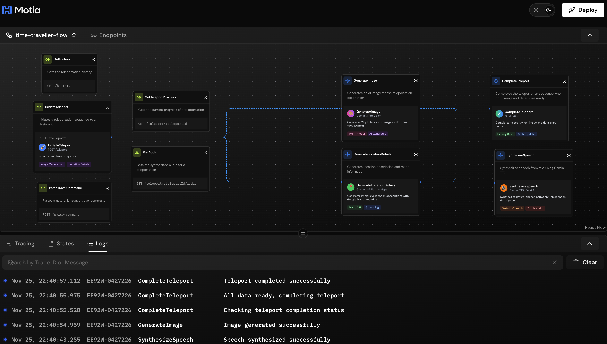
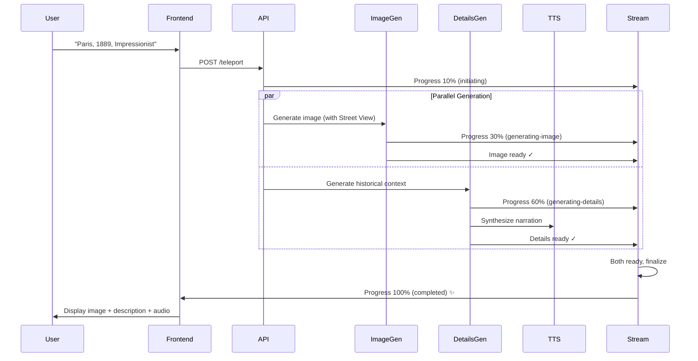

# 🌀 Time Traveller - Virtual Time Machine



<div align="center">


**Step into any moment in history. Witness the past. Visualize the future.**

*The world's first AI-powered virtual time machine that generates photorealistic 2K visualizations of any location across different eras, complete with immersive narration and historical context.*

[🚀 Try Demo](#-quick-start) • [📖 Documentation](#-api-reference) • [🎯 Features](#-what-makes-time-traveller-special)

</div>

---

## 🎬 What is Time Traveller?

Imagine standing in Paris... but not today's Paris. Picture the **Eiffel Tower under construction in 1888**, watch **ancient Rome at its peak**, or glimpse **Tokyo in 2150**. Time Traveller makes this possible.

Using **Google's cutting-edge Gemini 3 Pro (Nano Banana)** AI and **real-world Street View data**, Time Traveller doesn't just show you images—it **transports you through time**. Every visualization is grounded in actual geography and enhanced with AI imagination to create stunning, historically-aware recreations.

### ✨ The Magic Behind Time Traveller

```
🎯 You → "Show me Venice during the Renaissance, Baroque style"
                                ↓
        🧠 Google Gemini Nano Banana Pro analyzes request
                                ↓
        📍 Real Street View data grounds the location
                                ↓
        🎨 AI generates photorealistic 2K time-shifted image
                                ↓
        📝 Historical context & maps URI generated
                                ↓
        🔊 Immersive Fenrir voice narration synthesized
                                ↓
        ⚡ Real-time stream updates via Motia Streams
                                ↓
        🎭 YOU → Standing in 15th century Venice
```

---

## 🌟 What Makes Time Traveller Special?

### 1. **🤖 Powered by Google's Latest AI - Gemini Nano Banana Pro**

Time Traveller leverages **Gemini 3 Pro** (nicknamed "Nano Banana Pro"), Google's most advanced multimodal AI model for:
- **Photorealistic Image Generation** - 2048x2048 resolution, cinema-quality visuals
- **Context-Aware Synthesis** - Combines real Street View data with historical knowledge
- **Temporal Accuracy** - Understands architectural styles, fashion, technology across eras

### 2. **🗺️ Grounded in Reality**

Unlike generic AI image generators, Time Traveller:
- ✅ Uses **real GPS coordinates** from Google Maps
- ✅ Incorporates **actual Street View imagery** when available
- ✅ Provides **Maps URI links** to the real-world location
- ✅ Falls back gracefully with informative messages when Street View unavailable

### 3. **🎭 Multi-Sensory Experience**

- **Visual**: Stunning 2K AI-generated imagery
- **Narrative**: AI-generated historical descriptions with rich context
- **Audio**: Natural-sounding narration using Gemini 2.5 Flash TTS (Fenrir voice)
- **Interactive**: Click on maps, explore coordinates, select custom locations

### 4. **⚡ Built on Motia - Next-Gen Backend Framework**

Time Traveller showcases [Motia's](https://motia.dev) powerful features:

- **Event-Driven Architecture** - Parallel image & detail generation for blazing speed
- **Real-time Streams** - Live progress updates via WebSocket with polling fallback
- **Built-in Observability** - Full tracing, logging, and debugging in Workbench
- **State Management** - Redis-backed persistent storage for history
- **Type Safety** - End-to-end TypeScript with Zod schemas
- **Visual Workflow** - See your backend flow visualized in real-time

### 5. **🎨 Artistic Styles**

Choose from multiple visual styles:
- 📸 **Photorealistic** - Like being there in person
- 🎨 **Impressionist** - Monet-style soft brushwork
- 🖼️ **Renaissance** - Classical oil painting aesthetic
- 🌃 **Cyberpunk** - Neon-soaked futuristic vision
- 🖌️ **Baroque** - Dramatic, ornate compositions

### 6. **🕰️ Unlimited Era Travel**

Visit **any time period**:
- 🏛️ Ancient civilizations (Ancient Rome, Egypt, Greece)
- ⚔️ Medieval & Renaissance eras
- 🎩 Victorian age
- 🎺 Roaring 20s
- 🚀 Space Age 1960s
- 🌆 Modern day
- 🔮 Future (2050, 2100, 2150+)

### 7. **📊 Developer Experience**

- **Hot Module Reload** - Instant updates during development
- **Visual Debugging** - Motia Workbench shows every step
- **Trace IDs** - Track requests end-to-end across all steps
- **Structured Logging** - JSON logs with full context
- **Type Generation** - Auto-generated TypeScript types

---

## 🚀 Quick Start

### Prerequisites

- **Node.js 18+** and npm
- **Gemini API Key** - Get yours at [Google AI Studio](https://aistudio.google.com/apikey)
- **Google Maps API Key** - Optional but recommended for Street View ([Get key](https://developers.google.com/maps/documentation/javascript/get-api-key))

### Installation

```bash
# Clone the repository
git clone <your-repo-url>
cd time-traveller

# Install dependencies
npm install
```

### Configuration

Create a `.env` file in the project root:

```env
# Required: Gemini API Key for AI generation
GEMINI_API_KEY=your_gemini_api_key_here

# Optional: Google Maps API for Street View (highly recommended)
GOOGLE_API_KEY=your_google_maps_api_key_here
```

> 💡 **Pro Tip**: Enable both "Google Maps JavaScript API" and "Street View Static API" in Google Cloud Console for the best experience.

### Launch

```bash
# Terminal 1: Start the Motia backend
npm run backend

# Terminal 2: Start the React frontend
npm run dev
```

### Access Points

| Service | URL | Description |
|---------|-----|-------------|
| **🎮 Time Traveller App** | http://localhost:5173 | Main user interface |
| **🔌 Backend (API + Workbench)** | http://localhost:3000 | REST API endpoints + Visual debugging |

> 💡 **Note**: Motia serves both the API and Workbench UI on the same port (3000). When you visit http://localhost:3000, you'll see the Workbench interface. API endpoints like `/teleport`, `/history` are available on the same port.

---

## 🎮 How to Use

### Method 1: Simple Text Command

```
Type: "Take me to Paris in 1889, Impressionist style"
Press Enter → Watch the magic happen in real-time
```

### Method 2: Detailed Controls

1. **📍 Choose Location**
   - Type a destination OR
   - Click on the interactive map to select coordinates
   - See real-time geocoding and address lookup

2. **⏰ Select Era**
   - Ancient Rome (100 AD)
   - Medieval (1200 AD)
   - Renaissance (1500 AD)
   - Victorian Era (1890 AD)
   - Modern Day
   - Future (2100 AD)
   - ...or type any custom era!

3. **🎨 Pick Style**
   - Photorealistic (default)
   - Impressionist
   - Renaissance
   - Baroque
   - Cyberpunk

4. **🚀 Teleport!**
   - Watch real-time progress
   - See image generation (30% → 60%)
   - See detail generation (60% → 100%)
   - Enjoy the results with audio narration

### Method 3: Upload Reference Image

Want to see a specific building through time?
1. Upload a photo
2. Specify the era
3. AI generates what it looked like then!

---

## 📡 API Reference

### REST Endpoints

#### **POST** `/teleport`
Initiate a time travel visualization

**Request:**
```json
{
  "destination": "Paris, France",
  "era": "1889",
  "style": "Photorealistic",
  "coordinates": {
    "lat": 48.8584,
    "lng": 2.2945
  },
  "referenceImage": "base64_encoded_image" // optional
}
```

**Response:**
```json
{
  "teleportId": "teleport-1700000000000",
  "status": "initiated",
  "message": "Teleport sequence initiated. Monitor progress via stream."
}
```

#### **GET** `/teleport/:teleportId`
Get teleport progress and results

**Response:**
```json
{
  "id": "teleport-1700000000000",
  "destination": "Paris, France",
  "era": "1889",
  "style": "Photorealistic",
  "status": "completed",
  "progress": 100,
  "imageData": "base64_image_data",
  "description": "Historical description...",
  "mapsUri": "https://www.google.com/maps/...",
  "timestamp": 1700000000000
}
```

#### **GET** `/teleport/:teleportId/audio`
Get synthesized narration audio

**Response:**
```json
{
  "audioData": "base64_audio_data"
}
```

#### **GET** `/history?limit=10`
Get your time travel history

**Response:**
```json
{
  "history": [
    {
      "id": "teleport-1700000000000",
      "destination": "Paris, France",
      "era": "1889",
      "style": "Photorealistic",
      "imageData": "...",
      "description": "...",
      "mapsUri": "...",
      "timestamp": 1700000000000
    }
  ]
}
```

#### **POST** `/parse-command`
Parse natural language travel commands

**Request:**
```json
{
  "message": "Show me Tokyo in 2150, cyberpunk style",
  "history": ["Previous messages..."]
}
```

**Response:**
```json
{
  "isJump": true,
  "reply": "Initiating time jump to Tokyo, 2150...",
  "params": {
    "destination": "Tokyo, Japan",
    "era": "2150",
    "style": "Cyberpunk"
  }
}
```

---

## 🌊 Real-time Streaming API

Time Traveller uses **Motia Streams** for live progress updates:

```typescript
import { Stream } from '@motiadev/stream-client-browser';

// Connect to the stream server
const stream = new Stream('ws://localhost:3000');

// Subscribe to teleport progress
const subscription = stream.subscribeGroup('teleportProgress', 'active');

subscription.addChangeListener((teleports) => {
  const myTeleport = teleports?.find(t => t.id === teleportId);
  
  if (myTeleport) {
    console.log(`Progress: ${myTeleport.progress}%`);
    console.log(`Status: ${myTeleport.status}`);
    
    if (myTeleport.status === 'completed') {
      console.log('Time travel complete!');
      // Display image and description
    }
  }
});
```

### Stream Updates

Watch the progress in real-time:

```
Status: initiating       → Progress: 10%
Status: generating-image → Progress: 30%
Status: generating-details → Progress: 60%
Status: completed        → Progress: 100% ✨
```

---

## 🏗️ Architecture - The Motia Advantage

Time Traveller is built on **[Motia](https://motia.dev)**, a modern event-driven backend framework that makes building complex AI workflows elegant and observable.

```
┌────────────────────────────────────────────────────────────────────┐
│                      👤 React Frontend                             │
│              (Vite + TypeScript + Tailwind)                        │
│                     localhost:5173                                 │
└────────────────────┬──────────────────┬────────────────────────────┘
                     │                  │
            HTTP REST API        WebSocket Streams
                     │                  │
┌────────────────────▼──────────────────▼────────────────────────────┐
│                  🧠 Motia Backend Framework                         │
│                      localhost:3000                                │
├────────────────────────────────────────────────────────────────────┤
│                                                                    │
│  🔵 API Steps (REST Endpoints)    🟢 Event Steps (Background)     │
│  ──────────────────────────────   ───────────────────────────────  │
│  • InitiateTeleport               • GenerateImage                 │
│  • GetTeleportProgress            • GenerateLocationDetails       │
│  • GetHistory                     • SynthesizeSpeech              │
│  • GetAudio                       • CompleteTeleport              │
│  • ParseTravelCommand                                             │
│                                                                    │
│  🌊 Streams (Real-time)           💾 State (Persistent Storage)   │
│  ───────────────────────          ──────────────────────────────   │
│  • teleportProgress               • teleports                     │
│    └─ active (group)              • teleport-images               │
│                                   • teleport-details              │
│                                   • teleport-audio                │
│                                   • teleport-history              │
│                                                                    │
├────────────────────────────────────────────────────────────────────┤
│              🗄️ Redis In-Memory Storage (Motia Built-in)          │
└────────────────────┬──────────────────┬────────────────────────────┘
                     │                  │
            🎨 Gemini Nano Banana   🗺️ Google Maps API
            (Image + TTS + Text)    (Street View + Grounding)
```

### Why Motia?

| Traditional Backend | Motia Backend |
|---------------------|---------------|
| Manual WebSocket setup | Built-in streaming |
| Custom state management | Automatic Redis state |
| No visibility into flows | Visual Workbench debugging |
| Manual tracing setup | Automatic trace IDs |
| Complex event handling | Declarative emit/subscribe |

---

## 🎯 What Makes Time Traveller Special?

### 🧠 **Gemini Nano Banana Pro (Gemini 3 Pro)**

The secret sauce behind Time Traveller's stunning visuals:

- **2048x2048 Resolution** - Crystal clear, print-quality images
- **Multimodal Understanding** - Combines text descriptions with Street View photos
- **Temporal Intelligence** - Knows what Paris looked like in 1889 vs 1989 vs 2089
- **Style Mastery** - Can render in photorealistic, impressionist, baroque, and more
- **Context Awareness** - Understands era-appropriate architecture, vehicles, clothing

**Example Generation:**
```
Input: "London, 1666, during the Great Fire, Baroque style"
Gemini 3 Pro considers:
  ✓ 17th-century London architecture
  ✓ Fire's devastation patterns
  ✓ Baroque dramatic lighting
  ✓ Historical accuracy
  ✓ Real Thames River geography (from Street View)
Result: Breathtaking 2K image of burning medieval London 🔥
```

### 🌍 **Street View Intelligence**

When you pick a location:
1. 📡 Time Traveller fetches **real Street View imagery** (640x360)
2. 🧩 Gemini Nano Banana Pro uses it as **visual context**
3. 🎨 AI understands the actual geography, buildings, terrain
4. ✨ Generates historically-accurate **time-shifted version**

**Without Street View:** The app gracefully notifies you and generates based on description alone.

### ⚡ **Real-time Streaming with Motia**

Watch your time machine work in real-time:

```typescript
// Live updates without polling!
30% ████████░░░░░░░░░ Generating temporal visualization...
60% ████████████░░░░░ Researching historical context...
100% ████████████████ Time jump complete! ✨
```

- **No page refreshes** - Updates stream instantly via WebSocket
- **Automatic fallback** - Polls if WebSocket unavailable
- **Progress tracking** - See exactly what's happening

### 🔬 **Full Observability**

Every teleport is fully traceable in **Motia Workbench** (http://localhost:3000):

| Tab | What You See |
|-----|--------------|
| **Flow** | Visual diagram of the teleport workflow |
| **Endpoints** | All 5 API routes documented |
| **Logs** | Structured logs with trace IDs (e.g., `TSYEB-7716015`) |
| **States** | Inspect stored teleports, history, audio |

**Trace a request:**
```
[9:15:00 PM] ABC123-456 [INFO] InitiateTeleport - Starting
[9:15:02 PM] ABC123-456 [INFO] GenerateImage - Using Street View
[9:15:05 PM] ABC123-456 [INFO] GenerateLocationDetails - Complete
[9:15:07 PM] ABC123-456 [INFO] CompleteTeleport - Success ✓
```

### 🎙️ **Immersive Audio Narration**

Each teleport includes:
- **Gemini 2.5 Flash TTS** - Natural-sounding voice synthesis
- **Fenrir Voice Model** - Deep, authoritative narrator
- **Base64 Audio** - Instant playback, no file storage needed
- **Historical Context** - Learn about the location and era

---

## 📁 Project Structure

```
time-traveller/
│
├── 🎨 frontend/                    # React Frontend
│   ├── App.tsx                     # Main application logic
│   ├── apiClient.ts                # Motia API & Stream client
│   ├── audioUtils.ts               # Audio decoding utilities
│   ├── types.ts                    # TypeScript type definitions
│   ├── components/                 # UI Components
│   │   ├── ControlPanel.tsx        # Teleport controls & command input
│   │   ├── ViewScreen.tsx          # Image & description display
│   │   ├── MapSelector.tsx         # Interactive location picker
│   │   ├── HistoryLog.tsx          # Travel history sidebar
│   │   └── Header.tsx              # App header with branding
│   ├── vite.config.ts              # Vite configuration
│   ├── tsconfig.json               # Frontend TypeScript config
│   └── index.html                  # Entry point
│
├── ⚙️ steps/                       # Motia Backend Steps
│   │
│   ├── 🔵 api/                     # HTTP REST Endpoints
│   │   ├── initiateTeleport.step.ts      # POST /teleport
│   │   ├── getTeleportProgress.step.ts   # GET /teleport/:id
│   │   ├── getHistory.step.ts            # GET /history
│   │   ├── getAudio.step.ts              # GET /teleport/:id/audio
│   │   └── parseTravelCommand.step.ts    # POST /parse-command
│   │
│   ├── 🟢 events/                  # Background Event Handlers
│   │   ├── generateImage.step.ts         # AI image generation
│   │   ├── generateLocationDetails.step.ts # Historical context
│   │   ├── synthesizeSpeech.step.ts      # TTS narration
│   │   └── completeTeleport.step.ts      # Finalize & store
│   │
│   └── 🌊 streams/                 # Real-time Streams
│       └── teleportProgress.stream.ts    # Live progress updates
│
├── 🧩 services/                    # Business Logic Services
│   └── gemini/                     # Google Gemini AI Services
│       ├── imageService.ts         # Gemini 3 Pro image generation
│       ├── locationService.ts      # Gemini 2.5 Flash location details
│       ├── ttsService.ts           # Gemini 2.5 Flash TTS
│       └── commandParser.ts        # NLP command parsing
│
├── 📋 Configuration Files
│   ├── motia.config.ts             # Motia plugins & config
│   ├── tsconfig.json               # Backend TypeScript config
│   ├── package.json                # Dependencies & scripts
│   ├── .env                        # Environment variables (YOU CREATE THIS)
│   └── types.d.ts                  # Auto-generated Motia types
│
└── 📖 Documentation
    └── .cursor/rules/motia/        # Motia development guides
```

---

## 🎬 The Teleport Workflow

Here's what happens under the hood when you teleport:



### Step-by-Step Breakdown

1. **`InitiateTeleport` (API Step)**
   - Validates input
   - Generates unique teleport ID
   - Stores request in state
   - Emits parallel events
   - Returns teleport ID immediately

2. **`GenerateImage` (Event Step)** - *Parallel Execution*
   - Fetches Street View if coordinates provided
   - Calls Gemini 3 Pro (Nano Banana) with context
   - Generates 2048x2048 image
   - Stores in state with metadata
   - Emits `image-generated` event

3. **`GenerateLocationDetails` (Event Step)** - *Parallel Execution*
   - Uses Google Maps grounding
   - Calls Gemini 2.5 Flash for historical context
   - Generates rich description
   - Emits to TTS synthesis
   - Emits `location-details-generated` event

4. **`SynthesizeSpeech` (Event Step)** - *Non-blocking*
   - Receives description text
   - Calls Gemini 2.5 Flash TTS (Fenrir voice)
   - Stores audio in state
   - Non-critical (app works without audio)

5. **`CompleteTeleport` (Event Step)** - *Final Coordination*
   - Waits for both `image-generated` AND `location-details-generated`
   - Combines all data
   - Updates stream to 100% complete
   - Stores in history

### 🎯 Why This Architecture Rocks

- ✅ **Parallel Processing** - Image & details generate simultaneously (50% faster!)
- ✅ **Non-blocking Audio** - TTS doesn't slow down main flow
- ✅ **Resilient** - Each step retries independently if it fails
- ✅ **Observable** - Every step emits events and logs with trace IDs
- ✅ **Type-safe** - Full TypeScript across frontend & backend

---

## 🛠️ Motia Workbench

**The secret weapon for debugging and monitoring:**

### Access Workbench
Open **http://localhost:3000** while backend is running

### Features

#### 🎯 **Flow Visualization**
See your `time-traveller-flow` as an interactive graph:
- Blue nodes = API Steps
- Green nodes = Event Steps
- Yellow nodes = Streams
- Arrows show event flow

#### 📊 **Endpoints Tab**
Auto-generated API documentation:
- All 5 REST endpoints
- Request/response schemas
- Example payloads
- Test directly from UI

#### 🔍 **Logs Tab**
Structured logging with full context:
```
[9:15:00 PM] ABC123-456 [INFO] InitiateTeleport
             traceId: ABC123-456
             teleportId: teleport-1700000000000
             destination: Paris, France
```

#### 💾 **States Tab**
Inspect stored data:
- `teleports` - Active teleport requests
- `teleport-images` - Generated images
- `teleport-details` - Historical descriptions
- `teleport-audio` - Synthesized narrations
- `teleport-history` - Complete travel log

---

## 🧰 Technology Stack

### Backend (Motia)
| Technology | Purpose |
|-----------|---------|
| **Motia** | Event-driven backend framework |
| **TypeScript** | Type-safe development |
| **Zod** | Runtime schema validation |
| **Redis** | In-memory state storage |
| **Gemini 3 Pro** | 2K image generation (Nano Banana) |
| **Gemini 2.5 Flash** | Text & TTS generation |
| **Google Maps API** | Street View & location grounding |

### Frontend (React)
| Technology | Purpose |
|-----------|---------|
| **React 19** | UI framework |
| **TypeScript** | Type safety |
| **Vite** | Lightning-fast dev server & bundler |
| **Tailwind CSS** | Modern utility-first styling |
| **Lucide Icons** | Beautiful icon set |
| **Leaflet** | Backup map system |
| **@motiadev/stream-client-browser** | Real-time WebSocket streams |

### AI Models
| Model | Use Case | Why This Model? |
|-------|----------|-----------------|
| **Gemini 3 Pro** (Nano Banana) | Image generation | 2K resolution, multimodal, temporal understanding |
| **Gemini 2.5 Flash** | Location details | Fast, context-aware, grounding support |
| **Gemini 2.5 Flash TTS** | Audio narration | Natural voice, Fenrir model, low latency |
| **Gemini 2.5 Flash** | Command parsing | NLP understanding, low cost |

---

## 🔧 Development Guide

### NPM Scripts

```bash
npm run backend     # Start Motia backend (port 3000)
npm run dev         # Start Vite frontend (port 5173)
npm run build       # Build frontend for production
npm run preview     # Preview production build
```

### Adding New Features

#### Create a New API Step

```typescript
// steps/api/myNewEndpoint.step.ts
import { ApiRouteConfig, Handlers } from 'motia';
import { z } from 'zod';

export const config: ApiRouteConfig = {
  name: 'MyNewEndpoint',
  type: 'api',
  path: '/my-endpoint',
  method: 'GET',
  description: 'My awesome new endpoint',
  emits: [],
  flows: ['time-traveller-flow'],
  responseSchema: { 200: z.object({ message: z.string() }) }
};

export const handler: Handlers['MyNewEndpoint'] = async (req, { logger, traceId }) => {
  logger.info('My endpoint called', { traceId });
  return { status: 200, body: { message: 'Hello!' } };
};
```

#### Create a New Event Step

```typescript
// steps/events/myBackgroundTask.step.ts
import { EventConfig, Handlers } from 'motia';
import { z } from 'zod';

export const config: EventConfig = {
  name: 'MyBackgroundTask',
  type: 'event',
  description: 'Background processing',
  subscribes: ['my-event'],
  emits: ['task-completed'],
  input: z.object({ taskId: z.string() }),
  flows: ['time-traveller-flow']
};

export const handler: Handlers['MyBackgroundTask'] = async (input, { emit, logger, traceId }) => {
  const { taskId } = input;
  logger.info('Processing task', { traceId, taskId });
  
  // Do work...
  
  await emit({ topic: 'task-completed', data: { taskId } });
};
```

### Regenerate Types

After adding/modifying steps:

```bash
npx motia generate-types
```

This creates `types.d.ts` with all step handlers typed.

---

## 🐛 Troubleshooting

### 🔑 **API Key Issues**

**Error:** `Request had insufficient authentication scopes`

**Solution:**
1. Verify `.env` file exists in project root (not `.env.local`)
2. Check variable name is `GEMINI_API_KEY` (not `API_KEY`)
3. Get key from [Google AI Studio](https://aistudio.google.com/apikey)
4. Restart backend: `npm run backend`

### 🗺️ **Street View Unavailable**

**Message:** `"This visualization uses AI interpretation as Street View data is not available for this location."`

**This is normal!** Many locations don't have Street View (oceans, remote areas, historical sites). Time Traveller handles it gracefully:
- Shows informative message
- Generates beautiful AI visualization anyway
- Uses location description for context

### 🌐 **WebSocket Connection Failed**

**Error:** `WebSocket connection to 'ws://localhost:3000/' failed`

**Solution:**
1. This is usually harmless (React Strict Mode in dev)
2. App automatically falls back to HTTP polling
3. Verify backend is running: `curl http://localhost:3000/history?limit=1`
4. Check browser console for `[Stream] Connected successfully`

### 🔴 **Frontend Not Loading**

**Error:** `Failed to load resource: net::ERR_CONNECTION_REFUSED`

**Solution:**
1. Ensure both servers are running:
   ```bash
   # Terminal 1
   npm run backend
   
   # Terminal 2  
   npm run dev
   ```
2. Check ports aren't blocked by firewall
3. Hard refresh browser: `Cmd + Shift + R`

### 🐞 **TypeScript Errors**

**Error:** `Property 'InitiateTeleport' does not exist on type 'Handlers'`

**Solution:**
```bash
# Clean and regenerate
rm -rf node_modules .motia dist
npm install
npx motia generate-types

# Restart TypeScript server in your IDE
# VS Code/Cursor: Cmd+Shift+P → "TypeScript: Restart TS Server"
```

### 📊 **Traces Missing in Workbench**

All steps now include `traceId` in logs! Check:
1. Open Workbench at http://localhost:3000
2. Click **Logs** tab
3. Make a teleport request
4. See traces like: `[9:15:00 PM] ABC123-456 [INFO] InitiateTeleport`

---

## 🎨 Customization

### Change AI Voice

Edit `services/gemini/ttsService.ts`:

```typescript
const request = {
  model: "gemini-2.5-flash-preview-tts",
  systemInstruction: {
    parts: [{ text: "You are Odin" }]  // Change voice character
  },
  // ...
};
```

Available voices: Fenrir, Odin, Freya, and more.

### Adjust Image Quality

Edit `services/gemini/imageService.ts`:

```typescript
const primaryRequest = {
  model: 'gemini-2.5-flash-image',
  contents: [{
    parts: [{
      text: `Resolution: 4096x4096`  // Increase from 2048x2048
    }]
  }]
};
```

### Add Custom Eras

Update the era dropdown in `frontend/components/ControlPanel.tsx`:

```typescript
const eras = [
  "Ancient Rome (100 AD)",
  "Medieval (1200 AD)",
  "Your Custom Era (1776 AD)",  // Add here
  // ...
];
```

---

## 🚀 Production Deployment

### Build for Production

```bash
# Build frontend
npm run build

# The frontend will be in frontend/dist/
# Serve with any static host (Vercel, Netlify, Cloudflare)
```

### Environment Variables

**Production `.env`:**
```env
GEMINI_API_KEY=your_production_key
GOOGLE_API_KEY=your_production_key
PORT=3000
NODE_ENV=production
```

### Run Production Backend

```bash
npx motia start --port 3000
```

---

## 🎓 Learning Resources

### Motia Framework
- 📖 [Official Docs](https://motia.dev/docs)
- 🎯 [API Steps Guide](https://motia.dev/docs/getting-started/build-your-first-motia-app/creating-your-first-rest-api)
- 🎪 [Event Steps Guide](https://motia.dev/docs/getting-started/build-your-first-motia-app/background-jobs)
- 🌊 [Streams Guide](https://motia.dev/docs/getting-started/build-your-first-motia-app/streaming-agents)

### Google AI
- 🤖 [Gemini API Docs](https://ai.google.dev/gemini-api/docs)
- 🖼️ [Image Generation Guide](https://ai.google.dev/gemini-api/docs/imagen)
- 🔊 [TTS Documentation](https://ai.google.dev/gemini-api/docs/audio)

---

## 🌈 Use Cases

Time Traveller isn't just a tech demo—it's a powerful tool for:

- **🎓 Education** - Show students historical locations in vivid detail
- **🏛️ Museums** - Interactive historical visualizations
- **📚 Content Creation** - Generate period-accurate imagery for articles/videos
- **🎬 Pre-visualization** - Concept art for film/game productions
- **🏗️ Urban Planning** - Visualize future city developments
- **🎨 Art Projects** - Temporal photography series

---

## 🤝 Contributing

Time Traveller is a showcase of Motia's capabilities. Feel free to:
- Fork and experiment
- Add new AI models
- Extend with more eras/styles
- Improve UI/UX
- Share your coolest time travels!

---

## 📄 License

MIT License - Free to use, modify, and distribute.

---

<div align="center">

### 🌟 Built with Motia

**Experience the future of backend development**

[Motia Docs](https://motia.dev/docs) • [Motia Examples](https://github.com/MotiaDev/motia-examples) • [Motia Discord](https://discord.gg/motia)

---

**Made with ⚡ by the Motia Community**

*Powered by Google Gemini Nano Banana Pro 🍌*

</div>
